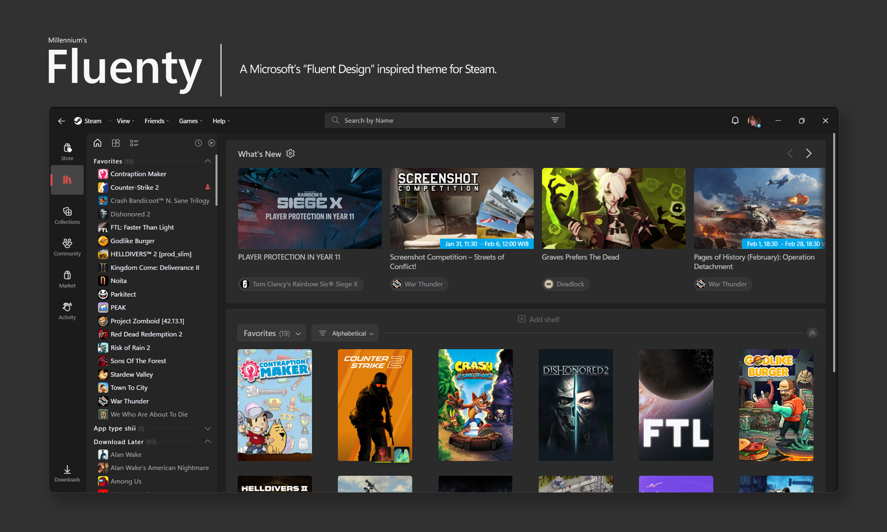
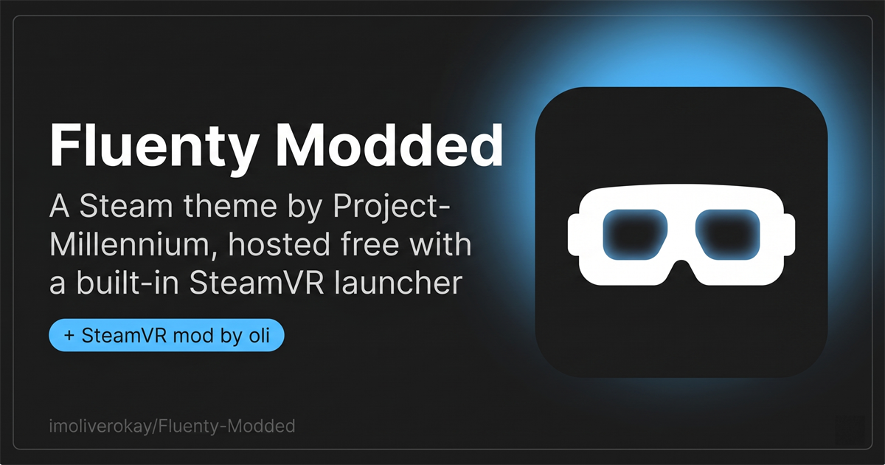
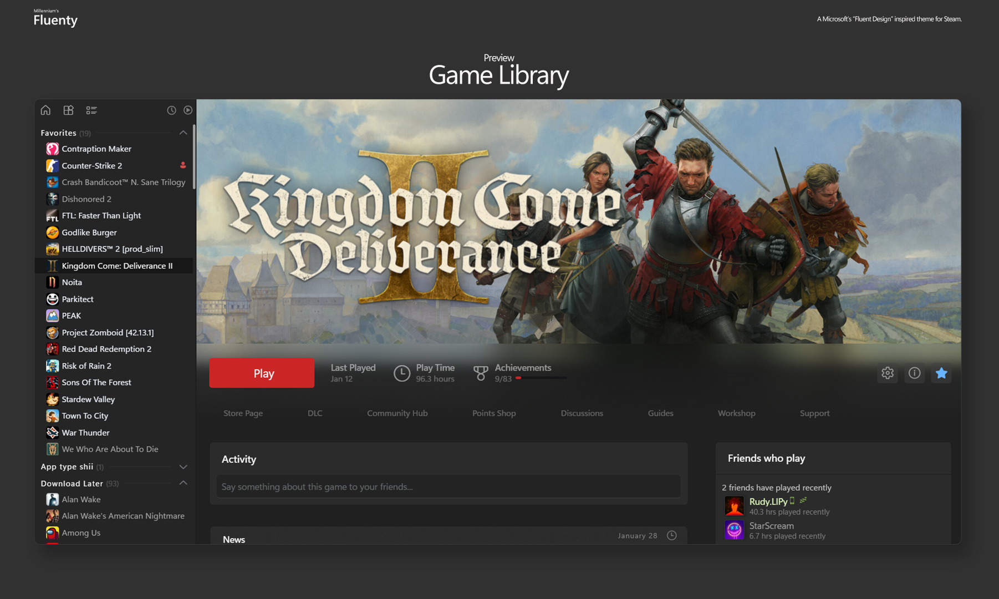
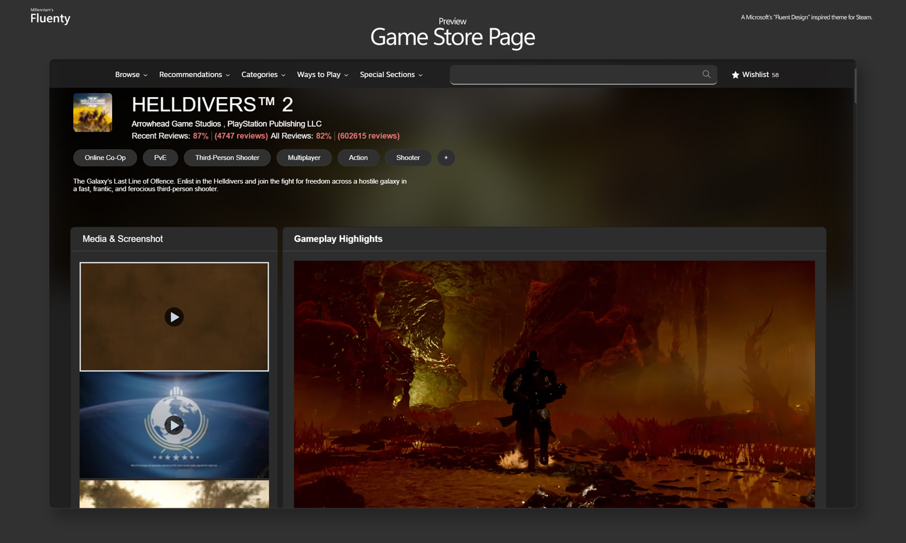
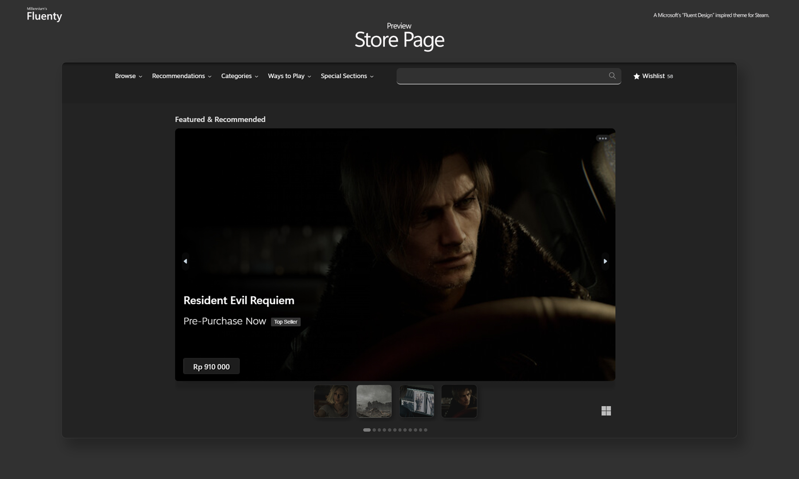
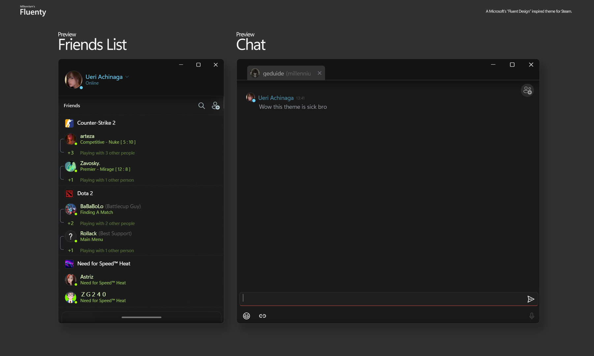
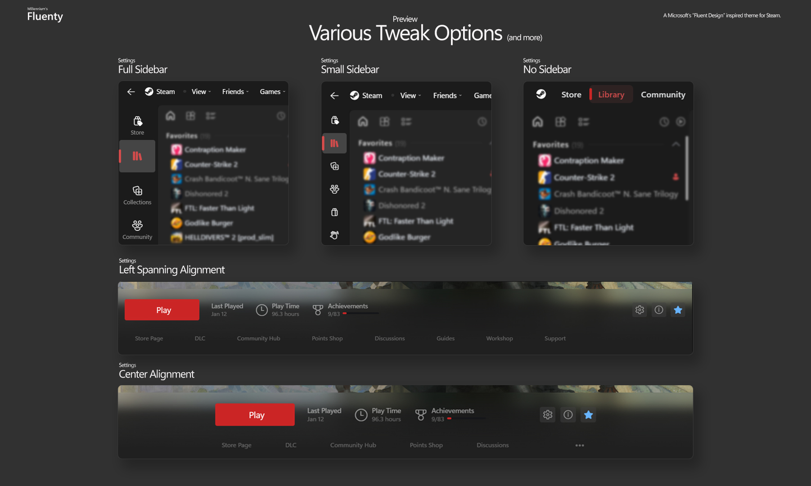

  

# Fluenty Modded

### A Steam theme based on Windows 11 design principles
### Originally a paid release. Hosted here **completely free**, with a built-in SteamVR launcher.

 

 

### [Visit the live site](https://fluenty-free.vercel.app) &nbsp;&middot;&nbsp; [Download latest](https://github.com/imoliverokay/Fluenty-Modded/releases) &nbsp;&middot;&nbsp; [Support Project-Millennium](https://steambrew.app)

 

 

---

## What this is

[**Fluenty**](https://steambrew.app/fluenty-steam) is a theme made by [**Project-Millennium**](https://steambrew.app), inspired by the Microsoft Store Fluent Design template launched with Windows 11. It restyles every surface of the Steam desktop client with acrylic blur, refined typography, and a Windows 11 sidebar.

The original ships as a paid release on Patreon. I (oli) bought a copy, used it daily, and added the one thing that was missing for me: a SteamVR launcher button planted right into the title bar.

This repo hosts that modified build of Fluenty, free, with full credit to the original team.

> If you end up using Fluenty daily, please consider [supporting Project-Millennium on Patreon](https://steambrew.app). They build and maintain Millennium itself, which is the framework that makes Fluenty (and every other Steam theme) possible. The framework is free; the servers aren't.

 

---

## The SteamVR mod

A SteamVR launcher icon sits in the Steam title bar, right between the profile avatar and the minimize button. One click routes to `steam://run/250820`, the same URL Steam uses internally to launch SteamVR.

No more enabling Tools in the library just to find SteamVR. Works with Quest Link, Index, anything SteamVR supports.

<b>Technical details</b>

| | |
|---|---|
| **Endpoint** | `steam://run/250820` |
| **Hit target** | 30 &times; 30 px (matches Steam's native action buttons) |
| **Persistence** | MutationObserver re-attaches the button if Steam's React tree drops it on navigation |
| **Files added** | [`src/scripts/vrButton.js`](Fluenty/src/scripts/vrButton.js) |
| **Files modified** | [`libraryroot.custom.js`](Fluenty/libraryroot.custom.js) (one import line) |
| **Visual footprint** | Pixel-matched to Steam's notification/profile buttons. Identical hover, identical rounding. |

 

---

## Features

Everything Fluenty does, plus the VR button:

<table>
<tr>
<td width="50%" valign="top">

#### Acrylic surfaces, everywhere
Title bar, modals, friends panel, overlays. All rebuilt with proper mica blur and a faint warm tint, matching the surface treatment Microsoft uses across Windows 11.

</td>
<td width="50%" valign="top">

#### Sidebar, three ways
Windows 11 expanding rail, tight compact strip, or no sidebar at all. Switch in Millennium's settings panel and Steam reflows in place. No restart.

</td>
</tr>
<tr>
<td width="50%" valign="top">

#### Library, your way
Full list with action buttons, a compact rail, or hide it entirely for maximum canvas. Move game stats to the bottom-right, bottom-center, or top-right. Align the play button left or centered.

</td>
<td width="50%" valign="top">

#### Stays out of your way
Hide the wallet, hide the navigation arrows, auto-hide the title bar. Pair them all and Steam becomes a near-borderless content surface.

</td>
</tr>
<tr>
<td width="50%" valign="top">

#### Color, tuned
Choose between a deep Fluent **Dark** scheme or the original **WinUI** palette. Accent colors follow your OS, including the Steam play button.

</td>
<td width="50%" valign="top">

#### + SteamVR title-bar launcher
The one thing this fork adds. A headset icon in the top right, one click away from SteamVR.

</td>
</tr>
</table>

 

---

## Screenshots

 

---

## Install

<table>
<tr>
<td width="60px" align="center" valign="top"><h3>1</h3></td>
<td valign="top">

### Install Millennium
The open-source theming framework Fluenty was designed for. Doesn't touch Steam's binaries.

</td>
</tr>
<tr>
<td width="60px" align="center" valign="top"><h3>2</h3></td>
<td valign="top">

### Download the zip
Grab the latest release. The zip includes the SteamVR title-bar button already baked in.

</td>
</tr>
<tr>
<td width="60px" align="center" valign="top"><h3>3</h3></td>
<td valign="top">

### Drop into Millennium's skins folder
Open Millennium inside Steam, click **Open skins folder**, drag the zip in, extract it.

</td>
</tr>
<tr>
<td width="60px" align="center" valign="top"><h3>4</h3></td>
<td valign="top">

### Select Fluenty
Pick it from Millennium's theme menu. Steam reskins on the spot. The headset icon shows up between your profile avatar and the minimize button.

</td>
</tr>
</table>

 

---

## Customize

Every tweak from the original Fluenty is here. Configure them from Millennium's settings panel inside Steam.

<b>All available tweaks</b>

 

| Tweak | Options | Default |
|---|---|---|
| **Sidebar view** | Windows 11, Compact, No sidebar | Windows 11 |
| **Title bar auto-hide** | Show, Hide | Show |
| **Scrollbar width** | 2px, 4px, 6px | 2px |
| **Wallet amount** | Hide, Show | Hide |
| **Navigation arrows** | Show, Hide | Show |
| **Library list** | Full, Compact, Hide | Full |
| **Play button alignment** | Center, Left spanning | Center |
| **Game stats position** | Bottom Right, Bottom Center, Top Right | Bottom Right |
| **Color scheme** | Dark, WinUI | Dark |
| **Profile view** | Default, Transparent | Default |
| **Game header width** | Full, Original | Full |
| **Store live broadcast** | Show, Hide | Show |
| **Play button color** | Match accent, Matte | Match accent |
| **What's New banner** | Show, Hide | Show |
| **Add Shelf prompt** | Show, Hide | Show |

 

---

## Credits

<table>
<tr>
<td width="33%" valign="top">

### Theme
**[Project-Millennium](https://steambrew.app)**

The original Fluenty.
Built by ShadowMonster &amp; Clawdius.

</td>
<td width="33%" valign="top">

### Framework
**[Millennium](https://steambrew.app)**

Open-source theming for the Steam desktop client.

</td>
<td width="33%" valign="top">

### VR mod &amp; free release
**oli**

SteamVR title-bar launcher.
This repo and the site.

</td>
</tr>
</table>

 

---

## A note on the original

The original Fluenty is a **paid** theme on Patreon for a reason: it funds the open-source framework that makes the whole modded-Steam scene possible. If you want to keep that ecosystem alive, [the Patreon](https://steambrew.app) is the right place to put your money.

This fork exists because I wanted a SteamVR button in my own copy. Releasing it free seemed fair: I'm not the one who designed it, I just added one thing on top.

 

---

## FAQ

<b>Is this safe? Does it modify Steam's binaries?</b>

 
Pure CSS and JavaScript loaded by Millennium. Never patches Steam itself. Uninstall the theme and Steam goes right back to its default look.

<b>Will it break when Steam updates?</b>

 
Occasionally Valve renames CSS classes and a small thing or two shifts. Project-Millennium ships fixes upstream; pull a new release here when one lands.

<b>Does the SteamVR button need a headset to appear?</b>

 
No, the button always appears. It routes through <code>steam://run/250820</code>, so Steam launches SteamVR if it's installed, otherwise nothing happens.

<b>Why free here when the original is paid?</b>

 
Personal build with a custom modification on top. The framework Fluenty runs on (Millennium) is free and open-source; the theme team funds itself via Patreon to keep the infrastructure running. Hit the Patreon if you use this daily.

<b>Does the VR mod work with Quest Link / Air Link?</b>

 
Yes. The button doesn't care which headset SteamVR is launching, it just opens SteamVR. Whatever your normal SteamVR launch flow is, the button respects it.

 

---

## License &amp; legal

Fluenty itself is the property of Project-Millennium. The original theme (`src/`, `libraryroot.custom.css`, the bulk of `libraryroot.custom.js`, and the original `LICENSE`) belongs to them.

The additions in this fork are:
- [`src/scripts/vrButton.js`](Fluenty/src/scripts/vrButton.js) (new file)
- A single import line in [`libraryroot.custom.js`](Fluenty/libraryroot.custom.js)
- This README and the screenshots folder

These additions are released under the same license as the original Fluenty. See [`LICENSE`](Fluenty/LICENSE) for the full terms.

Steam is a trademark of Valve Corporation. This project is not affiliated with Valve or Project-Millennium.

 

---

### Built on top of Fluenty by [Project-Millennium](https://steambrew.app). VR mod &amp; free release by [oli](https://github.com/imoliverokay).

 

